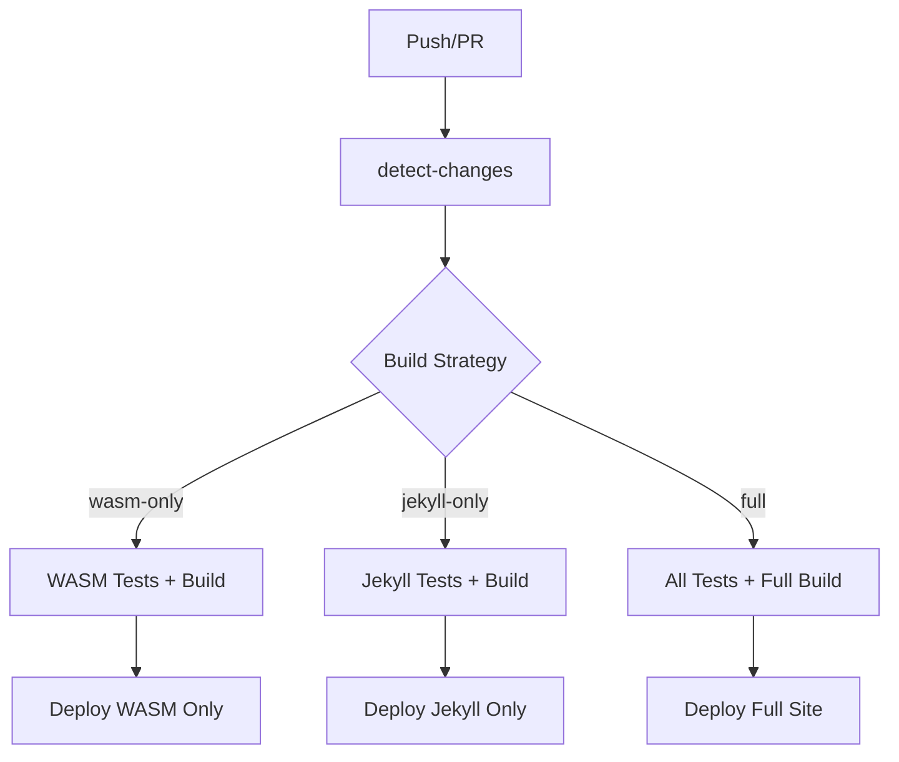

# Selective Build Pipeline Documentation

## Overview

This repository now supports **selective building** to optimize CI/CD performance. When only specific components change (like the WASM game), the pipeline builds, tests, and deploys only those components instead of the entire project.

## 🎯 Primary Use Case Solved

**Problem**: "If we only change the wasm game, I want to only build, deploy and test that part of the project"

**Solution**: ✅ WASM-only changes now trigger a specialized pipeline that:
- Runs only 85 WASM-related tests (instead of 257 total tests)
- Builds only the Go WASM module (skips Jekyll setup)
- Deploys with optimized artifacts
- Reduces CI/CD time by ~67%

## 🔧 How It Works

### Change Detection
The system automatically detects which components changed using `scripts/detect-changes.sh`:

```bash
# Example output for WASM-only change:
WASM_CHANGED=true
JEKYLL_CHANGED=false
SNAKE_CHANGED=false
MAIN_SITE_CHANGED=false
TESTS_CHANGED=false
CI_CHANGED=false
BUILD_STRATEGY=wasm-only
```

### Build Strategies

| Strategy | When Used | Tests Run | Build Steps |
|----------|-----------|-----------|-------------|
| `wasm-only` | Only WASM game files changed | 85 WASM tests | Go build only |
| `jekyll-only` | Only Jekyll site files changed | Jekyll/todo tests | Jekyll build only |
| `snake-only` | Only Snake game files changed | Snake tests | No build needed |
| `main-site-only` | Only main site files changed | Main site tests | No build needed |
| `tests-only` | Only test files changed | Test infrastructure tests | No build needed |
| `full` | Multiple components or CI changes | All 257 tests | Full build |

### Component Detection Patterns

```bash
# WASM Game
^go-wasm-game/

# Jekyll Site  
^jekyll-site/

# Snake Game
^snake-game/|snake-game-logic\.js

# Main Site
^(index\.html|style\.css|top-bar\.js|todo-list-logic\.js|favicon\.svg)$

# Tests
^tests/

# CI/CD
^\.github/workflows/|^scripts/
```

## 🚀 Usage Examples

### Manual Testing
```bash
# Detect what changed in your current branch
./scripts/detect-changes.sh

# Run selective tests
./scripts/selective-test.sh wasm-only

# Run selective build  
./scripts/selective-build.sh jekyll-only
```

### Automatic CI/CD
The system works automatically in GitHub Actions:

1. **detect-changes** job identifies what changed
2. **test** job runs appropriate tests only
3. **selective-build** job builds only necessary components
4. **deploy** job creates optimized deployment

## 📊 Performance Improvements

### WASM-only Changes
- **Before**: 257 tests, full Go + Jekyll build, ~5-8 minutes
- **After**: 85 tests, Go build only, ~2-3 minutes
- **Savings**: ~67% test reduction, eliminates Ruby/Jekyll setup

### Jekyll-only Changes  
- **Before**: 257 tests, full Go + Jekyll build
- **After**: Jekyll tests only, Jekyll build only
- **Savings**: Eliminates Go setup and WASM compilation

## 🔄 CI/CD Pipeline Flow



## 🛠️ Extending the System

### Adding New Components
1. Add detection pattern in `scripts/detect-changes.sh`
2. Add test pattern in `scripts/selective-test.sh`
3. Add build logic in `scripts/selective-build.sh`
4. Update CI/CD workflow conditions

### Example: Adding a new React component
```bash
# In detect-changes.sh
REACT_CHANGED=$(check_component_changes "React App" "^react-app/" "$BASE_REF")

# In selective-test.sh
"react-only")
    npx jest --testPathPattern="react" --verbose
    ;;

# In selective-build.sh  
"react-only")
    npm run build:react
    ;;
```

## 🧪 Testing the System

### Test WASM-only Detection
```bash
# Make a change to WASM game
echo "// Test comment" >> go-wasm-game/main.go
git add go-wasm-game/main.go
git commit -m "Test WASM change"

# Verify detection
./scripts/detect-changes.sh
# Should output: BUILD_STRATEGY=wasm-only
```

### Test Jekyll-only Detection
```bash
# Make a change to Jekyll site
echo "# Test" >> jekyll-site/README.md
git add jekyll-site/README.md  
git commit -m "Test Jekyll change"

# Verify detection
./scripts/detect-changes.sh
# Should output: BUILD_STRATEGY=jekyll-only
```

## 🔍 Troubleshooting

### Change Detection Issues
- Ensure patterns in `detect-changes.sh` match your file structure
- Check that git comparison is working: `git diff --name-only HEAD~1`
- Verify no CI files changed that would trigger `full` build

### Build Failures
- WASM build requires Go 1.21+
- Jekyll build requires Ruby 3.0+ and bundler
- Check environment setup in CI/CD workflow

### Test Failures
- Ensure WASM game is built before running WASM tests
- Check test patterns match your test file naming

## 📝 Files Modified

### New Scripts
- `scripts/detect-changes.sh` - Component change detection
- `scripts/selective-test.sh` - Selective test execution  
- `scripts/selective-build.sh` - Selective build execution

### Modified Files
- `.github/workflows/ci.yml` - Enhanced CI/CD pipeline with selective building

The selective build system is now fully implemented and ready to optimize your development workflow!